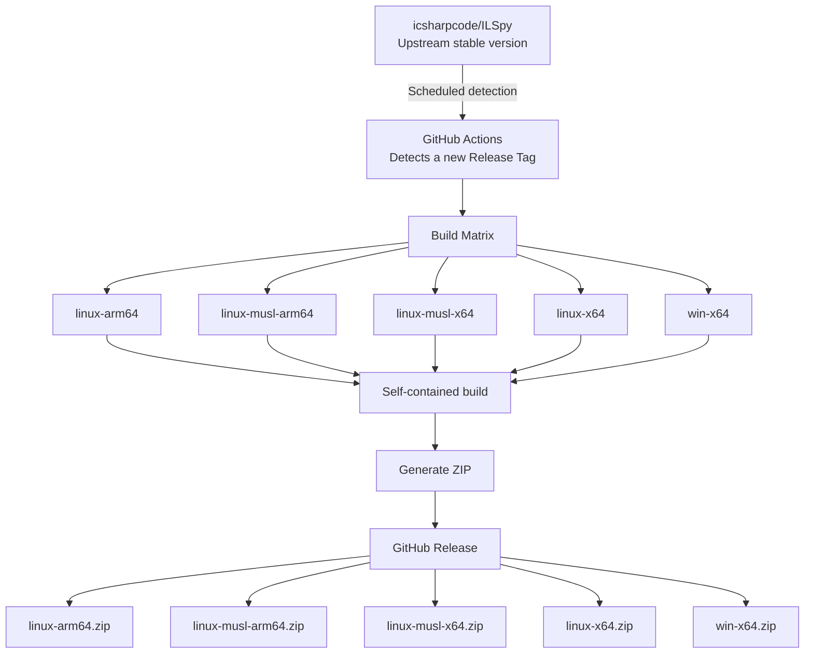
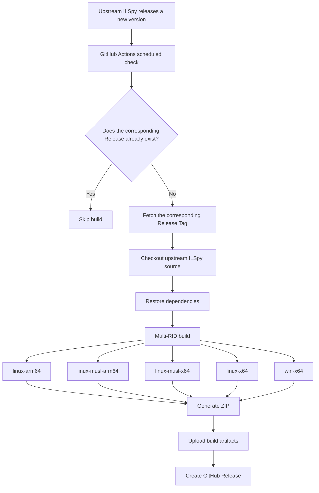

# ILSpy Binaries

Unofficial automated self-contained builds of [ILSpy](https://github.com/icsharpcode/ILSpy).

This repository automatically tracks new stable releases from the upstream ILSpy project, builds ILSpy for multiple target platforms, packages each build as a standalone ZIP archive, and publishes the resulting binaries as GitHub Releases.

The generated packages are intended to run without requiring users to install the .NET SDK or .NET Runtime separately.

> **Disclaimer:** This is an unofficial third-party project and is not affiliated with, maintained by, or endorsed by the ILSpy project or its maintainers.

## Features

* Automatically checks the upstream ILSpy repository for new stable releases
* Automatically builds newly released versions
* Self-contained publishing with the .NET runtime included
* No .NET SDK installation required on the target machine
* Multiple platform and architecture targets
* Automatic ZIP packaging
* Automatic GitHub Release creation
* Stable download URLs through `releases/latest`

## Supported Builds

Each upstream ILSpy release is built into the following packages:

| Target             | Package                |
| ------------------ | ---------------------- |
| Linux ARM64        | `linux-arm64.zip`      |
| Linux ARM64 (musl) | `linux-musl-arm64.zip` |
| Linux x64 (musl)   | `linux-musl-x64.zip`   |
| Linux x64          | `linux-x64.zip`        |
| Windows x64        | `win-x64.zip`          |

The exact availability of a target depends on the upstream ILSpy source and its native dependencies.

In particular, the `linux-musl-*` builds use the .NET musl runtime identifiers and require the native dependencies used by ILSpy/Avalonia to be compatible with the target environment.

## Downloads

Open the [Releases](../../releases) page to download a specific version.

For the latest release, stable asset URLs are also available:

```text
https://github.com/<OWNER>/ILSpy-Binaries/releases/latest/download/win-x64.zip
https://github.com/<OWNER>/ILSpy-Binaries/releases/latest/download/linux-x64.zip
https://github.com/<OWNER>/ILSpy-Binaries/releases/latest/download/linux-arm64.zip
https://github.com/<OWNER>/ILSpy-Binaries/releases/latest/download/linux-musl-x64.zip
https://github.com/<OWNER>/ILSpy-Binaries/releases/latest/download/linux-musl-arm64.zip
```

Replace `<OWNER>` with the GitHub account or organization that owns this repository.

## How It Works

The workflow is designed to avoid maintaining a fork of ILSpy.



The build environment is provided by GitHub Actions. The .NET SDK is only required during the CI build process and is not bundled as a prerequisite for end users.

## Release Synchronization

The workflow periodically checks:

```text
https://github.com/icsharpcode/ILSpy/releases
```

When a new stable upstream release is detected, the workflow:





If the corresponding release already exists, the workflow does not rebuild it automatically.

A manual workflow dispatch can also be used to build a specific upstream tag.

## Self-Contained Builds

The builds use .NET self-contained publishing.

Conceptually, the build process is equivalent to:

```bash
dotnet publish \
  --configuration Release \
  --self-contained \
  --runtime <RID>
```

This means the generated package includes the .NET runtime required by ILSpy.

End users therefore do **not** need to install:

* .NET SDK
* .NET Runtime
* ASP.NET Core Runtime

The package can be extracted and launched directly, subject to the requirements of the target operating system and native dependencies.

## Linux musl Builds

The `linux-musl-x64` and `linux-musl-arm64` packages are intended for Linux distributions using musl libc, such as Alpine Linux.

These builds are separate from the regular glibc-based Linux packages:

```text
linux-x64
linux-arm64
```

and should not be treated as interchangeable.

Because ILSpy is a desktop application and uses native components through dependencies such as Avalonia and SkiaSharp, successful .NET publishing alone does not guarantee compatibility with every musl-based environment.

For this reason, musl builds should be validated on an actual musl-based system before being considered universally compatible.

## Repository Structure

The repository itself does not need to contain a copy of the ILSpy source code.

A minimal setup can look like:

```text
ILSpy-Binaries/
├── .github/
│   └── workflows/
│       └── ilspy-release.yml
└── README.md
```

The source code is fetched from the upstream repository during GitHub Actions execution.

This keeps the repository lightweight and avoids maintaining a permanent fork solely for binary distribution.

## Versioning

Release tags follow the upstream ILSpy release tags.

For example:

```text
Upstream:
icsharpcode/ILSpy
└── v11.1

This repository:
ILSpy-Binaries
└── v11.1
```

The source version is therefore traceable directly to the upstream ILSpy release.

## Source

Upstream project:

* Repository: https://github.com/icsharpcode/ILSpy
* Releases: https://github.com/icsharpcode/ILSpy/releases

This repository builds from the upstream ILSpy source and does not modify the ILSpy source code unless explicitly stated in a particular workflow or release.

## License

The binaries distributed here are built from the ILSpy project.

Please refer to the upstream ILSpy repository for the applicable source code licenses, third-party licenses, notices, and attribution requirements:

https://github.com/icsharpcode/ILSpy

This repository's GitHub Actions workflow and other original repository-specific files are provided under the license specified by this repository, unless otherwise stated.

## Disclaimer

This project is provided for convenience and binary distribution purposes.

It is:

* **not an official ILSpy distribution**
* **not affiliated with the ILSpy maintainers**
* **not a replacement for the upstream ILSpy repository**

For source code, official releases, issue tracking, development, and project information, please refer to the upstream repository:

https://github.com/icsharpcode/ILSpy

## Contributing

Issues and pull requests related to the automation workflow, packaging, and build infrastructure are welcome.

For bugs or feature requests concerning ILSpy itself, please report them to the upstream ILSpy project instead:

https://github.com/icsharpcode/ILSpy/issues
