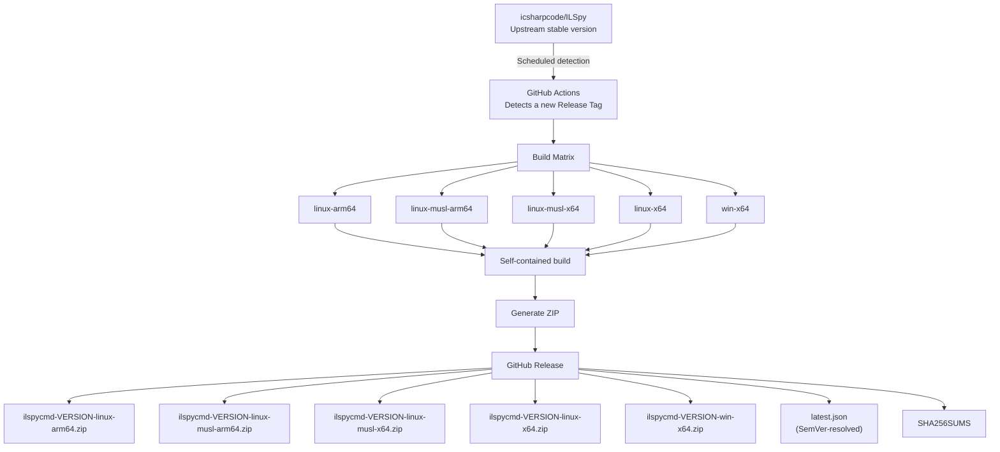
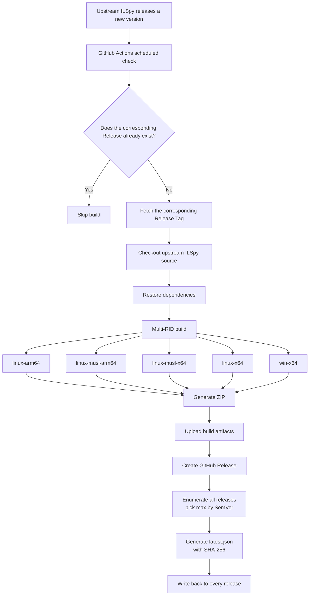

# ILSpy Binaries

Unofficial automated, self-contained builds of [ILSpy](https://github.com/icsharpcode/ILSpy).

[](https://github.com/taozhiyu/ILSpy-Binaries/releases/latest)
[](https://github.com/taozhiyu/ILSpy-Binaries/actions/workflows/build-ilspycmd.yml)
[](https://github.com/taozhiyu/ILSpy-Binaries/blob/main/LICENSE)

English | [简体中文](README.zh.md)

This repository automatically tracks new stable releases of the upstream ILSpy project, builds `ilspycmd` for multiple platforms and architectures in GitHub Actions, packages each build as an independent ZIP archive, and publishes the result as a GitHub Release.

The published archives are built as **self-contained**, so the target machine does not need the .NET SDK or the .NET Runtime installed separately.

> **Disclaimer:** This is an unofficial third-party project. It is not affiliated with, maintained by, or endorsed by the ILSpy project or its maintainers.

## Features

* Automatically detects new stable releases of upstream ILSpy
* Automatically builds a new version once upstream publishes a stable release
* Self-contained publishing, with the .NET runtime bundled
* Target machines need neither the .NET SDK nor the .NET Runtime
* Supports Linux x64, Linux ARM64, Windows x64, and additionally provides Linux musl builds
* Automatically produces ZIP archives and creates a GitHub Release
* Every release ships a machine-readable `latest.json` manifest with absolute download URLs and SHA-256 per platform
* No long-lived ILSpy source fork has to be maintained

## Supported Platforms

Each upstream ILSpy release is built into the following targets by default:

| Platform | Architecture / Runtime| RID                |
| -------- | --------------------- | ------------------- |
| Linux    | ARM64                 | `linux-arm64`       |
| Linux    | ARM64 / musl          | `linux-musl-arm64`  |
| Linux    | x64 / musl            | `linux-musl-x64`    |
| Linux    | x64                   | `linux-x64`         |
| Windows  | x64                   | `win-x64`           |

> The table above lists the RID (Runtime Identifier). The actual published asset names also embed the upstream tag, e.g. `ilspycmd-v11.1-linux-x64.zip`. See [Downloads](#downloads) for details.

Whether a given target can be built and run successfully depends on the source of the corresponding ILSpy version and on its native dependencies.

## Downloads

Go to the [Releases](https://github.com/taozhiyu/ILSpy-Binaries/releases) page to download a specific version.

Each release contains the following assets:

| Platform / Runtime              | Asset name template                      |
| ------------------------------- | ---------------------------------------- |
| Linux x64 (glibc)               | `ilspycmd-<TAG>-linux-x64.zip`           |
| Linux ARM64 (glibc)             | `ilspycmd-<TAG>-linux-arm64.zip`         |
| Linux x64 (musl, e.g. Alpine)   | `ilspycmd-<TAG>-linux-musl-x64.zip`      |
| Linux ARM64 (musl)              | `ilspycmd-<TAG>-linux-musl-arm64.zip`    |
| Windows x64| `ilspycmd-<TAG>-win-x64.zip`             |
| Checksums for all of the above  | `SHA256SUMS`                             |

`<TAG>` is the upstream ILSpy release tag, for example `v11.1`.

### Automated updates via `latest.json`

Every release includes a machine-readable manifest named `latest.json`. It records the **current latest version** together with the absolute download URL and SHA-256 of each platform asset, and is suitable for direct consumption by automation scripts.

The manifest for the latest version is available at a fixed, version-independent URL:

```text
https://github.com/taozhiyu/ILSpy-Binaries/releases/latest/download/latest.json
```

This URL does not change between releases, so it is safe to hard-code.

> **Note: the version in `latest` is resolved by SemVer, not by publication time.**
>
> GitHub's own `releases/latest` points to the most recently *published*
> non-draft, non-prerelease release. If `v11.0` is published first and `v10.0`
> second, GitHub will point `latest` at `v10.0`, which is semantically wrong.
> Therefore the `latest_version` recorded in this project's `latest.json` is
> determined by **SemVer comparison across all release tags**, and is independent
> of publication time. See [Version Selection Rules](#version-selection-rules).

Structure of `latest.json`:

```json
{
  "schema_version": 1,
  "repository": "https://github.com/taozhiyu/ILSpy-Binaries",
  "latest_version": "v11.1",
  "generated_at": "2026-10-07T01:23:45Z",
  "assets": [
    {
      "rid": "linux-arm64",
      "url": "https://github.com/taozhiyu/ILSpy-Binaries/releases/download/v11.1/ilspycmd-v11.1-linux-arm64.zip",
      "sha256": "e3b0c44298fc1c149afbf4c8996fb92427ae41e4649b934ca495991b7852b855"
    },
    { "rid": "linux-musl-arm64", "...": "..." },
    { "rid": "linux-musl-x64", "...": "..." },
    { "rid": "linux-x64", "...": "..." },
    { "rid": "win-x64", "...": "..." }
  ],
  "license": {
    "repository": "MIT",
    "upstream": "MIT",
    "gcc_runtime_libraries": "GPL-3.0-or-later WITH GCC-exception-3.1",
    "gcc_runtime_libraries_scope": "linux-musl-* only",
    "_comment": {
      "en": "\"repository\" refers to the original files in this repository; \"upstream\" refers to the ILSpy binaries distributed with the packages. Only the linux-musl-* packages additionally bundle the GCC runtime libraries.",
      "zh-CN": "repository 指本仓库原创文件；upstream 指随包分发的 ILSpy 二进制。仅 linux-musl-* 包额外包含 GCC 运行时库。"
    }
  },
  "_comment": {
    "en": "This file is generated automatically by GitHub Actions; do not edit manually.\nlatest_version is the version with the greatest SemVer value, not the most recently published one.",
    "zh-CN": "本文件由 GitHub Actions 自动生成，请勿手工编辑。\nlatest_version 是按 SemVer 数值比较得出的最大版本，不是发布时间最新的版本。"
  }
}
```

Keys beginning with an underscore are comment fields and may be safely ignored by clients.

> **Breaking format change.** `latest.json` was slimmed down to the fields shown
> above. The previously documented `upstream_version`, `upstream_repository`,
> `upstream_release_url`, `version_resolution`, `checksum_source`, `checksums`
> and `assets[].file` entries have been **removed**; the asset file name is
> directly derivable from `url`. The meaning and location of `latest_version`
> and of each asset's `rid` / `url` / `sha256` are **unchanged**. Clients that
> read any removed field should use `url` and `assets[].sha256` instead.
>
> Note that `assets` is an **array** (not an object keyed by RID), and there is
> no `size` field — use `Content-Length` from the download response if a size is
> needed.

Command-line example:

```bash
# 1) Read the manifest and extract the latest version
LATEST_TAG=$(curl -fsSL https://github.com/taozhiyu/ILSpy-Binaries/releases/latest/download/latest.json \
  | grep -o '"latest_version": *"[^"]*"' | cut -d '"' -f 4)

# 2) Download by the absolute URL from the manifest and verify SHA-256
URL="https://github.com/taozhiyu/ILSpy-Binaries/releases/download/${LATEST_TAG}/ilspycmd-${LATEST_TAG}-linux-x64.zip"
curl -fLO "$URL"
curl -fsSL "https://github.com/taozhiyu/ILSpy-Binaries/releases/download/${LATEST_TAG}/SHA256SUMS" \
  | grep "linux-x64.zip$" | sha256sum -c -
```

### About `releases/latest/download/<file>`

GitHub provides no aliasing for asset names, and this project's asset names embed
the upstream tag. Consequently, a URL shaped like
`releases/latest/download/linux-x64.zip` **cannot be resolved** and returns 404.
Use the `latest.json` mechanism above; it is the genuinely stable entry point.

## Automation Workflow

This project neither forks ILSpy nor keeps a permanent copy of the ILSpy source code in this repository.

The overall flow is as follows:


```mermaid
flowchart TD
    A["icsharpcode/ILSpy<br/>Upstream stable version"] -->|Scheduled detection| B["GitHub Actions<br/>Detects a new Release Tag"]
    B --> C["Build Matrix"]

    C --> D["linux-arm64"]
    C --> E["linux-musl-arm64"]
    C --> F["linux-musl-x64"]
    C --> G["linux-x64"]
    C --> H["win-x64"]

    D --> I["Self-contained build"]
    E --> I
    F --> I
    G --> I
    H --> I

    I --> J["Generate ZIP"]
    J --> K["GitHub Release"]

    K --> L["ilspycmd-VERSION-linux-arm64.zip"]
    K --> M["ilspycmd-VERSION-linux-musl-arm64.zip"]
    K --> N["ilspycmd-VERSION-linux-musl-x64.zip"]
    K --> O["ilspycmd-VERSION-linux-x64.zip"]
    K --> P["ilspycmd-VERSION-win-x64.zip"]
    K --> Q["latest.json<br/>(SemVer-resolved)"]
    K --> R["SHA256SUMS"]
```

GitHub Actions provides the build environment.

Therefore:

> **The .NET SDK exists only inside the GitHub Actions build environment. It is not a prerequisite for end users.**

## Release Synchronization

GitHub Actions periodically checks:

```text
https://github.com/icsharpcode/ILSpy/releases
```

When a new stable version is detected, the following steps run automatically:


```mermaid
flowchart TD
    A["Upstream ILSpy releases a new version"] --> B["GitHub Actions scheduled check"]
    B --> C{"Does the corresponding Release already exist?"}
    C -->|Yes| D["Skip build"]
    C -->|No| E["Fetch the corresponding Release Tag"]

    E --> F["Checkout upstream ILSpy source"]
    F --> G["Restore dependencies"]
    G --> H["Multi-RID build"]

    H --> I["linux-arm64"]
    H --> J["linux-musl-arm64"]
    H --> K["linux-musl-x64"]
    H --> L["linux-x64"]
    H --> M["win-x64"]

    I --> N["Generate ZIP"]
    J --> N
    K --> N
    L --> N
    M --> N

    N --> O["Upload build artifacts"]
    O --> P["Create GitHub Release"]
    P --> Q["Enumerate all releases<br/>pick max by SemVer"]
    Q --> R["Generate latest.json<br/>with SHA-256"]
    R --> S["Write back to every release"]
```

For example, when upstream publishes:

```text
icsharpcode/ILSpy
└── v11.2
```

this repository automatically produces:

```text
ILSpy-Binaries
└── v11.2
    ├── ilspycmd-v11.2-linux-arm64.zip
    ├── ilspycmd-v11.2-linux-musl-arm64.zip
    ├── ilspycmd-v11.2-linux-musl-x64.zip
    ├── ilspycmd-v11.2-linux-x64.zip
    ├── ilspycmd-v11.2-win-x64.zip
    ├── latest.json
    └── SHA256SUMS
```

If the corresponding release already exists with a complete set of assets, it is not rebuilt. If the release exists but some assets are missing, the build runs again to complete the set.

A specific upstream tag can also be built manually via the GitHub Actions "Run workflow" function.

### Version Selection Rules

The `latest_version` recorded in `latest.json` is determined as follows:

1. Enumerate **all** releases of this repository, across every version. Exclude drafts and prereleases.
2. Parse each tag as SemVer, strip the leading `v`, and compare `major.minor.patch` segment by segment as integers.
3. The greatest value becomes `latest_version`. On a tie, fall back to comparing the raw tag strings.
4. **Publication time is not a ranking criterion.**

This guarantees that even if `v11.0` is published before `v10.0`, `latest.json`
still correctly points at `v11.0`.

> This rule differs from GitHub's built-in `releases/latest` semantics, which ranks
> by publication time and would therefore point at `v10.0` in the scenario above.
> Always rely on `latest.json` instead.

## Self-Contained Builds

This project uses .NET self-contained publishing.

The core build logic is equivalent to:

```bash
dotnet publish \
  --configuration Release \
  --self-contained \
  --runtime <RID>
```

The build output therefore contains the .NET runtime required to run ILSpy.

End users generally do not need to install any of the following:

```text
.NET SDK
.NET Runtime
```

Usage is essentially:

```text
Download the ZIP
   ↓
Extract
   ↓
Run ilspycmd
```

The target operating system and its native dependency requirements still have to be satisfied.

## Linux and Linux musl

This repository provides both regular Linux and musl Linux builds:

```text
linux-x64
linux-arm64
```

as well as:

```text
linux-musl-x64
linux-musl-arm64
```

ILSpy is a desktop GUI application and relies on native components such as Avalonia and SkiaSharp. Therefore:

> A successful .NET musl publish does not automatically imply that all native ILSpy dependencies work in every musl-based Linux environment.

For this reason, extra checks are performed on the musl build artifacts. Actual use should still be validated on the target musl-based distribution.

### GCC Runtime Libraries Bundled with the Packages

The `ilspycmd` executable declares the following dynamic dependencies:

```text
NEEDED  libstdc++.so.6
NEEDED  libgcc_s.so.1
```

A .NET self-contained publish bundles the .NET runtime but **not** the GCC runtime libraries, and a minimal Alpine installation does not provide them either. Running the binary on such a system fails with:

```text
Error loading shared library libstdc++.so.6: No such file or directory
```

To make the archives usable immediately after extraction, every `linux-musl-*` archive ships these two libraries alongside the executable, and `RPATH=$ORIGIN` is injected into all relevant ELF binaries so the loader resolves them from the package directory.

| File            | Size    | Purpose                       |
| --------------- | ------- | ----------------------------- |
| `libstdc++.so.6` | ~2.7 MB | C++ standard library          |
| `libgcc_s.so.1` | ~170 KB | GCC low-level runtime         |

Both files come from the Alpine Linux `libstdc++` and `libgcc` packages.

> Licensing details, including the exact applicable license expressions and the redistribution conditions, are described in the "Bundled GCC Runtime Libraries" section of [License](#license).

If your system already provides these two libraries, the copies inside the package are not used and can be safely deleted.

## Archive Contents

Each published ZIP archive contains:

| File / Directory                  | Description                                                |
| --------------------------------- | ---------------------------------------------------------- |
| `ilspycmd`                        | The executable (self-contained, no .NET installation needed) |
| `*.dll`, `*.so`                   | Application assemblies and the bundled .NET runtime         |
| `LICENSE`                         | Upstream ILSpy license (MIT)                                |
| `README.md`                       | This document (English)                                     |
| `README.zh.md`                    | This document (Chinese)                                     |
| `README-UPSTREAM.md`              | Upstream `ilspycmd` documentation                           |
| `BUILD-INFO.txt`                  | Upstream tag, commit, build date, and SDK used              |
| `LICENSE-GCC-RUNTIME-LIBRARY.txt` | GCC runtime library licensing, full texts (musl packages only)   |
| `GCC-RUNTIME-LIBRARIES.txt`       | Bundled GCC library versions (musl packages only)           |

`LICENSE-GCC-RUNTIME-LIBRARY.txt` contains the **full text** of the GPLv3 and of
the GCC Runtime Library Exception 3.1, rather than links only.

## Versioning

Release tags of this repository follow the upstream ILSpy release tags.

For example:

```text
Upstream:
icsharpcode/ILSpy
└── v11.1

This repository:
ILSpy-Binaries
└── v11.1
```

Every release of this repository can therefore be traced directly back to the corresponding upstream ILSpy release.

## Upstream Project

Official ILSpy repository:

https://github.com/icsharpcode/ILSpy

Official releases:

https://github.com/icsharpcode/ILSpy/releases

This repository builds binaries from the upstream ILSpy source and does not modify the ILSpy source code by default.

## Relationship with Official ILSpy

This project:

* **is not official ILSpy**
* **is not the official ILSpy distribution repository**
* **is not maintained by the ILSpy project**
* **does not represent the ILSpy project or its maintainers**

The sole purpose of this project is to provide automated, multi-platform, self-contained binary builds.

For ILSpy source code, development, issues, official releases, and project documentation, visit:

https://github.com/icsharpcode/ILSpy

## License

### Original Content of This Repository

The GitHub Actions workflows, scripts, and other original files of this repository are licensed under the **MIT License**.

The full license text is in the [LICENSE](LICENSE) file at the root of this repository.

### Upstream ILSpy

The binaries published here are built from the ILSpy project.

The upstream ILSpy project is distributed under the MIT License. Its source license, third-party component licenses, copyright statements, and related notices are those of the upstream project:

https://github.com/icsharpcode/ILSpy

Third-party components bundled into `ilspycmd` (including Avalonia, NuGet.Protocol, and the .NET runtime itself) are licensed separately by their respective authors. Refer to the upstream project for the authoritative list:

https://github.com/icsharpcode/ILSpy/blob/main/doc/third-party-notices.txt

### Bundled GCC Runtime Libraries (`linux-musl-*` only)

Every `linux-musl-*` archive ships the following GCC runtime libraries so that the packages work on minimal musl Linux distributions (such as Alpine) immediately after extraction:

| File                     | Size    | Purpose                  |
| ------------------------ | ------- | ------------------------ |
| `libstdc++.so.6`         | ~2.7 MB | C++ standard library     |
| `libgcc_s.so.1`          | ~170 KB | GCC low-level runtime    |

Provenance:

* Both files are taken **unmodified** from the official Alpine Linux repositories
  (the `libstdc++` and `libgcc` packages of the `gcc` source package).
* The exact package versions are recorded in `GCC-RUNTIME-LIBRARIES.txt` inside the archive.

Licensing:

* Upstream GCC distributes these runtime libraries under
  `GPL-3.0-or-later WITH GCC-exception-3.1` — that is, the GNU General Public
  License version 3 (or, at your option, any later version) together with the
  **GCC Runtime Library Exception 3.1**.
* The GCC Runtime Library Exception is an *additional permission* layered on top
  of the GPL. It is not a standalone license. Its Section 1 explicitly grants
  "permission to propagate a work of Target Code formed by combining the Runtime
  Library with Independent Modules", which is what allows these libraries to be
  shipped inside a non-GPL binary distribution such as this one.
* Alpine Linux's own package metadata tags the `gcc` source package as
  `GPL-2.0-or-later AND LGPL-2.1-or-later`. That is Alpine's packaging label for
  the package as a whole; the authoritative license of the shipped
  `libstdc++.so.6` and `libgcc_s.so.1` files is the upstream GCC statement above.
* The archives carry these files **unmodified**; only the ELF binaries that
  depend on them are patched with `RPATH=$ORIGIN`.

Obligations when redistributing:

* The GPL and the exception require that the license texts travel with the
  binaries. `LICENSE-GCC-RUNTIME-LIBRARY.txt` therefore embeds the **complete text**
  of the GPLv3 and of the GCC Runtime Library Exception 3.1, rather than only
  linking to them.
* Alpine's binary repository does not ship license files inside the package, and
  the base image contains no `/usr/share/licenses` directory at all, so the license
  texts must be embedded explicitly at packaging time.

If your system already provides these two libraries, the copies inside the archive are not used and can be safely deleted.

> Note: `RPATH=$ORIGIN` is injected into the ELF binaries that depend on these two libraries, so the musl loader can find them in the package directory.

## Disclaimer

This project is provided as-is, primarily to make it easier to obtain automated builds of ILSpy.

Because differences may exist across ILSpy versions, operating systems, CPU architectures, and native dependencies:

* No guarantee is made that every platform runs correctly on every Linux distribution
* No guarantee is made that every musl-based Linux environment is fully compatible
* No guarantee is made that every future upstream ILSpy version can be built without modification

For formal use, please validate the binaries on the target platform yourself.

## Contributing

Issues and pull requests related to the following topics are welcome:

* GitHub Actions
* Automatic version detection
* Multi-platform builds
* ZIP packaging
* Automatic release publishing
* Build environment and scripts
* Binary publishing pipeline

For questions about ILSpy itself, its bugs, or development, please go to the upstream project:

https://github.com/icsharpcode/ILSpy/issues