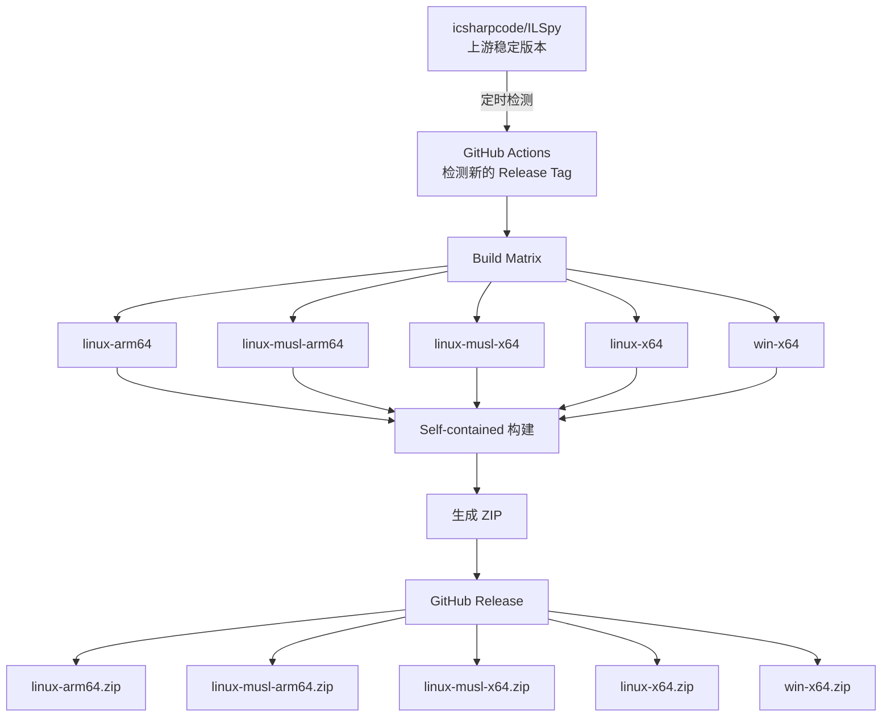
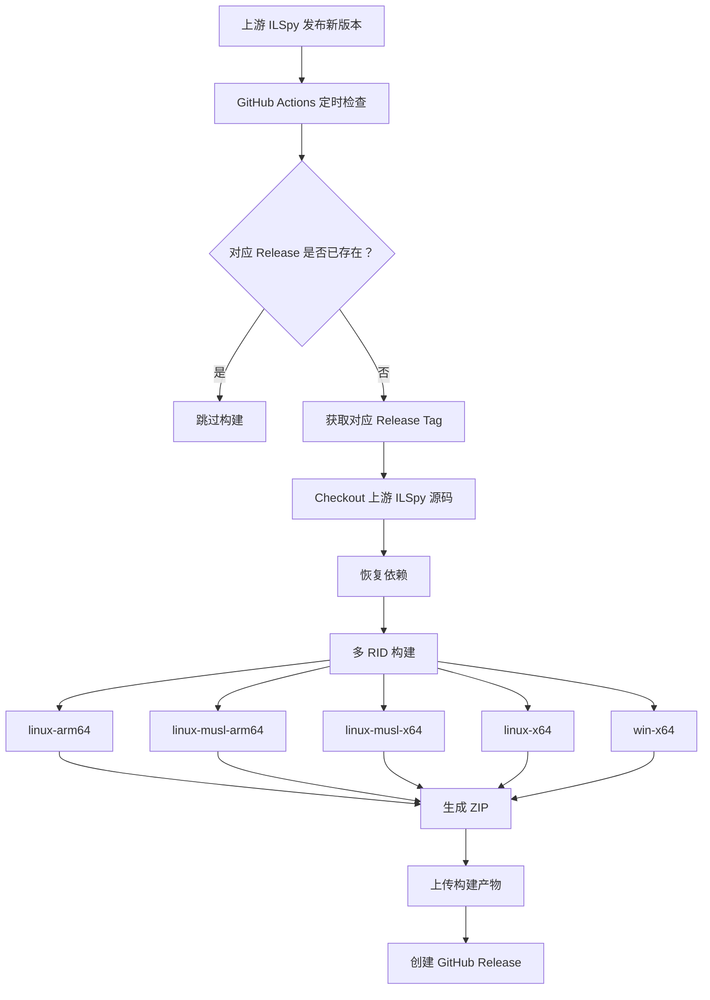

# ILSpy Binaries

[ILSpy](https://github.com/icsharpcode/ILSpy) 的非官方自动化、自包含二进制构建项目。

本仓库自动跟踪上游 ILSpy 项目的最新稳定版本，在 GitHub Actions 中为多个平台和架构进行构建，将每个平台的构建结果打包为独立 ZIP，并自动发布到 GitHub Releases。

生成的安装包采用 **Self-contained（自包含）** 方式发布，目标设备无需额外安装 .NET SDK 或 .NET Runtime 即可运行。

> **声明：** 本项目是非官方第三方项目，与 ILSpy 项目及其维护者不存在隶属、维护或官方认可关系。

## 项目特点

* 自动检测上游 ILSpy 新版本
* 上游发布新稳定版后自动构建
* 使用 Self-contained 方式发布
* 目标设备无需安装 .NET SDK
* 目标设备无需单独安装 .NET Runtime
* 支持 Linux x64、Linux ARM64、Windows x64 等平台
* 提供 Linux musl 构建
* 自动生成 ZIP 安装包
* 自动创建 GitHub Release
* 提供稳定的 `releases/latest` 下载地址
* 无需维护 ILSpy 源码 Fork

## 支持的平台

每个上游 ILSpy Release 默认构建以下目标：

| 平台      | 架构 / 运行环境    | 文件                     |
| ------- | ------------ | ---------------------- |
| Linux   | ARM64        | `linux-arm64.zip`      |
| Linux   | ARM64 / musl | `linux-musl-arm64.zip` |
| Linux   | x64 / musl   | `linux-musl-x64.zip`   |
| Linux   | x64          | `linux-x64.zip`        |
| Windows | x64          | `win-x64.zip`          |

具体目标是否可以成功构建和运行，取决于对应 ILSpy 版本的源码以及其原生依赖。

特别是：

```text
linux-musl-x64
linux-musl-arm64
```

除了 .NET 本身需要支持对应 musl Runtime Identifier 外，ILSpy 使用的 Avalonia、SkiaSharp 等原生组件也必须能够在目标 musl 环境中正常运行。

因此，musl 构建不会简单地将普通 Linux 构建重新命名，而是作为独立目标进行构建和检查。

## 下载

可以进入 [Releases](../../releases) 页面下载指定版本。

最新版本还可以通过以下固定地址下载：

```text
https://github.com/<OWNER>/ILSpy-Binaries/releases/latest/download/win-x64.zip
https://github.com/<OWNER>/ILSpy-Binaries/releases/latest/download/linux-x64.zip
https://github.com/<OWNER>/ILSpy-Binaries/releases/latest/download/linux-arm64.zip
https://github.com/<OWNER>/ILSpy-Binaries/releases/latest/download/linux-musl-x64.zip
https://github.com/<OWNER>/ILSpy-Binaries/releases/latest/download/linux-musl-arm64.zip
```

将 `<OWNER>` 替换为实际 GitHub 用户名或组织名。

例如：

```text
https://github.com/example/ILSpy-Binaries/releases/latest/download/win-x64.zip
```

这样无论当前最新版本是：

```text
v11.1
v11.2
v12.0
```

下载地址都无需修改。

## 自动化流程

本项目不需要 Fork ILSpy，也不需要将 ILSpy 源码长期复制到本仓库。

整体流程如下：



GitHub Actions 负责提供构建环境。

因此：

> **.NET SDK 只存在于 GitHub Actions 的构建环境中，不需要安装到最终用户的电脑上。**

## Release 同步机制

GitHub Actions 会定期检查上游：

```text
https://github.com/icsharpcode/ILSpy/releases
```

检测到新的稳定版本后，会自动执行以下操作：



例如上游发布：

```text
icsharpcode/ILSpy
└── v11.2
```

本仓库会自动产生：

```text
ILSpy-Binaries
└── v11.2
    ├── linux-arm64.zip
    ├── linux-musl-arm64.zip
    ├── linux-musl-x64.zip
    ├── linux-x64.zip
    └── win-x64.zip
```

如果对应版本已经存在，则不会重复创建 Release。

同时也可以通过 GitHub Actions 的手动运行功能指定需要构建的上游 Tag。

## Self-contained 自包含构建

本项目使用 .NET 的 Self-contained 发布方式。

其核心构建逻辑等价于：

```bash
dotnet publish \
  --configuration Release \
  --self-contained \
  --runtime <RID>
```

构建结果会包含运行 ILSpy 所需要的 .NET Runtime。

因此，最终用户通常不需要额外安装：

```text
.NET SDK
.NET Runtime
ASP.NET Core Runtime
```

使用方式基本就是：

```text
下载 ZIP
   ↓
解压
   ↓
运行 ILSpy
```

具体仍然需要满足目标操作系统以及相关原生依赖的要求。

## Linux 与 Linux musl

本项目同时提供普通 Linux 和 musl Linux 构建：

```text
linux-x64
linux-arm64
```

以及：

```text
linux-musl-x64
linux-musl-arm64
```

二者并不完全等价。

普通 Linux 主要面向使用 glibc 的 Linux 环境，而 musl 构建主要面向使用 musl libc 的发行版，例如 Alpine Linux。

因此：

```text
linux-x64.zip
```

不应直接视为：

```text
linux-musl-x64.zip
```

的替代品。

ILSpy 属于桌面 GUI 应用，并依赖 Avalonia、SkiaSharp 等原生组件，因此：

> .NET 的 musl 发布成功，并不自动意味着所有 ILSpy 原生依赖都能够在所有 musl Linux 环境中正常运行。

因此，本项目会对 musl 构建进行额外的构建产物检查；实际使用时仍建议在目标 musl Linux 环境中进行验证。

## 仓库结构

本仓库不需要保存 ILSpy 的完整源代码。

最小结构可以是：

```text
ILSpy-Binaries/
├── .github/
│   └── workflows/
│       └── ilspy-release.yml
└── README.md
```

GitHub Actions 在构建时直接从上游仓库获取对应版本的 ILSpy 源码。

这样可以避免：

* 维护 ILSpy Fork
* 手动同步上游代码
* 保存大量重复源代码
* 为了发布二进制文件而长期维护源码副本

## 版本规则

本仓库直接跟随上游 ILSpy 的 Release Tag。

例如：

```text
上游：
icsharpcode/ILSpy
└── v11.1

本仓库：
ILSpy-Binaries
└── v11.1
```

因此每一个本仓库 Release 都可以直接追溯到对应的上游 ILSpy Release。

## 上游项目

ILSpy 官方仓库：

https://github.com/icsharpcode/ILSpy

官方 Release：

https://github.com/icsharpcode/ILSpy/releases

本项目基于上游 ILSpy 源码构建二进制文件，默认不修改 ILSpy 源码。

## 与官方 ILSpy 的关系

本项目：

* **不是官方 ILSpy**
* **不是 ILSpy 官方发行仓库**
* **不是 ILSpy 官方维护的项目**
* **不代表 ILSpy 项目或其维护者**

本项目的主要目的只是提供自动化的、多平台、自包含二进制构建。

关于 ILSpy 的源码、开发、Issue、官方 Release 及项目说明，请访问：

https://github.com/icsharpcode/ILSpy

## License

本项目发布的二进制文件来源于 ILSpy 项目。

ILSpy 的源码许可、第三方依赖许可、版权声明及相关 Notices 请以上游项目为准：

https://github.com/icsharpcode/ILSpy

本仓库自身的 GitHub Actions、脚本和其他原创文件，则以本仓库声明的 License 为准。

## Disclaimer

本项目按“现状”提供，主要用于方便获取 ILSpy 的自动化构建版本。

由于不同 ILSpy 版本、操作系统、CPU 架构以及原生依赖之间可能存在差异：

* 不保证所有平台在所有 Linux 发行版上都能正常运行
* 不保证所有 musl Linux 环境都完全兼容
* 不保证上游 ILSpy 的所有未来版本都能够无修改直接构建

对于正式使用，请结合目标平台自行验证。

## Contributing

欢迎提交与以下内容有关的 Issue 或 Pull Request：

* GitHub Actions
* 自动版本检测
* 多平台构建
* ZIP 打包
* Release 自动发布
* 构建环境与脚本
* 二进制发布流程

如果是 ILSpy 本身的功能、Bug 或开发问题，请直接向上游项目提交：

https://github.com/icsharpcode/ILSpy/issues
