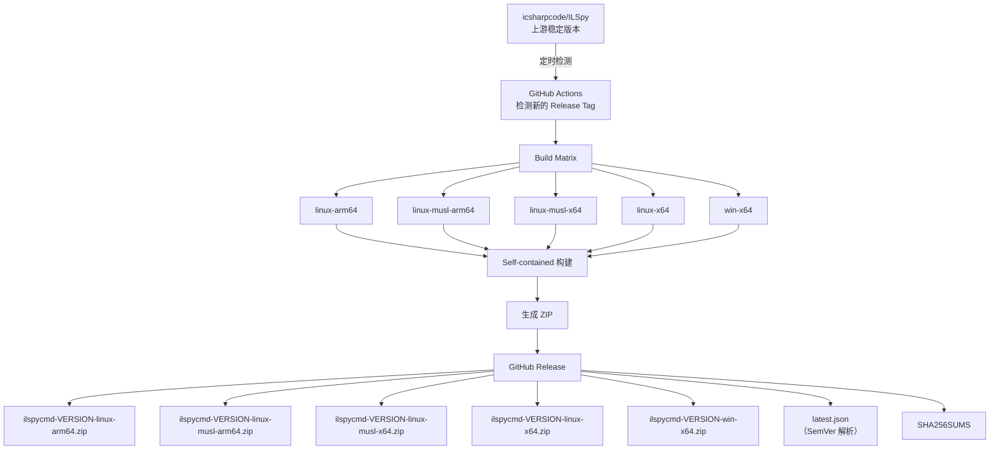
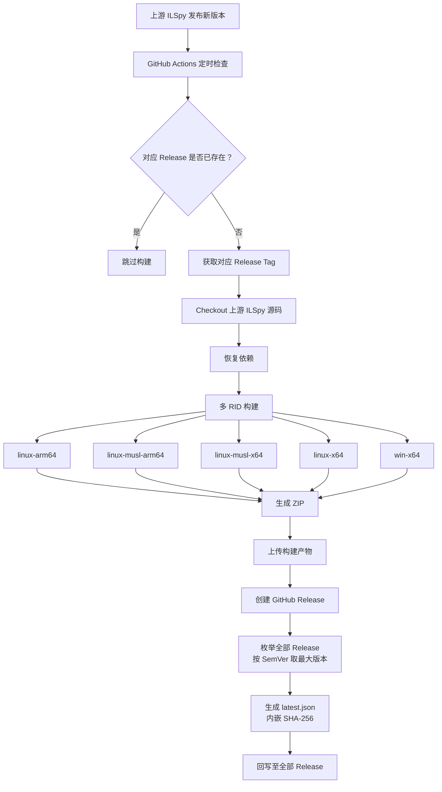

# ILSpy Binaries

[ILSpy](https://github.com/icsharpcode/ILSpy) 的非官方自动化、自包含二进制构建项目。

[](https://github.com/taozhiyu/ILSpy-Binaries/releases/latest)
[](https://github.com/taozhiyu/ILSpy-Binaries/actions/workflows/build-ilspycmd.yml)
[](https://github.com/taozhiyu/ILSpy-Binaries/blob/main/LICENSE)

[English](README.md) | 简体中文

本仓库自动跟踪上游 `ILSpy` 项目的最新稳定版本，在 GitHub Actions 中为多个平台和架构进行构建，将每个平台的构建结果打包为独立 ZIP，并自动发布到 GitHub Releases。

生成的安装包采用 **Self-contained（自包含）** 方式发布，目标设备无需额外安装 .NET SDK 或 .NET Runtime 即可运行。

> **声明：** 本项目是非官方第三方项目，与 ILSpy 项目及其维护者不存在隶属、维护或官方认可关系。

## 项目特点

* 自动检测上游 ILSpy 新版本
* 上游发布新稳定版后自动构建
* 使用 Self-contained 方式发布，目标设备无需安装 .NET SDK / Runtime
* 支持 Linux x64、Linux ARM64、Windows x64 等平台，并提供 Linux musl 构建
* 对于不同构建，自动化校验`-h`、`--version`、**真实**反编译dll
* 自动生成 ZIP 安装包并创建 GitHub Release
* 每个 Release 均附带 `latest.json` 机器可读清单，含各平台绝对下载地址与 SHA-256
* 无需维护 ILSpy 源码 Fork

## 支持的平台

每个上游 ILSpy Release 默认构建以下目标：

| 平台    | 架构 / 运行环境 | RID              |
| ------- | ------------ | ------------------ |
| Linux   | ARM64        | `linux-arm64`      |
| Linux   | ARM64 / musl | `linux-musl-arm64` |
| Linux   | x64 / musl   | `linux-musl-x64`   |
| Linux   | x64          | `linux-x64`        |
| Windows | x64          | `win-x64`          |

> 上表列出的是 RID（Runtime Identifier）。实际发布的资产文件名还包含上游 tag，
> 例如 `ilspycmd-v11.1-linux-x64.zip`。详见 [下载](#下载)。

具体目标是否可以成功构建和运行，取决于对应 ILSpy 版本的源码以及其原生依赖。

## 下载

可以进入 [Releases](https://github.com/taozhiyu/ILSpy-Binaries/releases) 页面下载指定版本。

每个 Release 包含以下资产：

| 平台 /运行环境                 | 资产文件名模板       |
| ------------------------- | --------------- |
| Linux x64 (glibc)         | `ilspycmd-<TAG>-linux-x64.zip` |
| Linux ARM64 (glibc)       | `ilspycmd-<TAG>-linux-arm64.zip` |
| Linux x64 (musl, 如 Alpine) | `ilspycmd-<TAG>-linux-musl-x64.zip` |
| Linux ARM64 (musl)        | `ilspycmd-<TAG>-linux-musl-arm64.zip` |
| Windows x64| `ilspycmd-<TAG>-win-x64.zip` |
| 上述全部资产的校验和        | `SHA256SUMS`      |
| 当前最新版本信息            | `latest.json` |

`<TAG>` 为上游 ILSpy 的 Release Tag，例如 `v11.1`。

### 自动获取最新版本：`latest.json`

每个 Release 都包含一个名为 `latest.json` 的机器可读清单。它记录了**当前最新版本**下
每个平台的资产绝对下载地址与 SHA-256，适合自动化脚本直接消费。

最新版本的清单可以通过固定地址获取：

```text
https://github.com/taozhiyu/ILSpy-Binaries/releases/latest/download/latest.json
```

该地址与版本号无关，因此长期有效，**无需修改**。

> **注意：`latest` 的版本选择基于 SemVer 解析，而非发布时间。**
>
> 如果先发布 `v11.0`、后发布 `v10.0`，GitHub 可能会把 `latest` 指向 `v10.0`，
> 这在语义上是错误的。因此本项目的 `latest.json` 中记录的版本由
> **对全部 Release tag 做 SemVer 比较后取最大者**得出，与发布时间无关。
> 详细规则见下方 [版本选择规则](#版本选择规则)。

`latest.json` 结构示例：

```json
{
  "schema_version": 1,
  "repository": "https://github.com/taozhiyu/ILSpy-Binaries",
  "latest_version": "v11.1",
  "generated_at": "2026-10-07T01:23:45Z",
  "assets": [
    {
      "rid": "linux-arm64",
      "url": "https://github.com/taozhiyu/ILSpy-Binaries/releases/download/v11.1/ilspycmd-v11.1-linux-arm64.zip",
      "sha256": "e3b0c44298fc1c149afbf4c8996fb92427ae41e4649b934ca495991b7852b855"
    },
    { "rid": "linux-musl-arm64", "...": "..." },
    { "rid": "linux-musl-x64", "...": "..." },
    { "rid": "linux-x64", "...": "..." },
    { "rid": "win-x64", "...": "..." }
  ],
  "license": {
    "repository": "MIT",
    "upstream": "MIT",
    "gcc_runtime_libraries": "GPL-3.0-or-later WITH GCC-exception-3.1",
    "gcc_runtime_libraries_scope": "linux-musl-* only",
    "_comment": {
      "en": "\"repository\" refers to the original files in this repository; \"upstream\" refers to the ILSpy binaries distributed with the packages. Only the linux-musl-* packages additionally bundle the GCC runtime libraries.",
      "zh-CN": "repository 指本仓库原创文件；upstream 指随包分发的 ILSpy 二进制。仅 linux-musl-* 包额外包含 GCC 运行时库。"
    }
  },
  "_comment": {
    "en": "This file is generated automatically by GitHub Actions; do not edit manually.\nlatest_version is the version with the greatest SemVer value, not the most recently published one.",
    "zh-CN": "本文件由 GitHub Actions 自动生成，请勿手工编辑。\nlatest_version 是按 SemVer 数值比较得出的最大版本，不是发布时间最新的版本。"
  }
}
```

命令行下载示例：

```bash
# 1) 取清单，解析出最新版本号
LATEST_TAG=$(curl -fsSL https://github.com/taozhiyu/ILSpy-Binaries/releases/latest/download/latest.json \
  | grep -o '"latest_version": *"[^"]*"' | cut -d '"' -f 4)

# 2) 按清单里的绝对地址下载，并校验 SHA-256
URL="https://github.com/taozhiyu/ILSpy-Binaries/releases/download/${LATEST_TAG}/ilspycmd-${LATEST_TAG}-linux-x64.zip"
curl -fLO "$URL"
curl -fsSL "https://github.com/taozhiyu/ILSpy-Binaries/releases/download/${LATEST_TAG}/SHA256SUMS" \
  | grep "linux-x64.zip$" | sha256sum -c -
```

### 关于 `releases/latest/download/<文件名>`

GitHub 不会为资产名提供别名，而本项目的资产文件名内含上游 tag，因此形如
`releases/latest/download/linux-x64.zip` 的地址**无法解析**（会返回 404）。
请使用上面的 `latest.json` 方案，它才是真正稳定的入口。

## 自动化流程

本项目不需要 Fork ILSpy，也不需要将 ILSpy 源码长期复制到本仓库。

整体流程如下：


```mermaid
flowchart TD
    A["icsharpcode/ILSpy<br/>上游稳定版本"] -->|定时检测| B["GitHub Actions<br/>检测新的 Release Tag"]
    B --> C["Build Matrix"]

    C --> D["linux-arm64"]
    C --> E["linux-musl-arm64"]
    C --> F["linux-musl-x64"]
    C --> G["linux-x64"]
    C --> H["win-x64"]

    D --> I["Self-contained 构建"]
    E --> I
    F --> I
    G --> I
    H --> I

    I --> J["生成 ZIP"]
    J --> K["GitHub Release"]

    K --> L["ilspycmd-VERSION-linux-arm64.zip"]
    K --> M["ilspycmd-VERSION-linux-musl-arm64.zip"]
    K --> N["ilspycmd-VERSION-linux-musl-x64.zip"]
    K --> O["ilspycmd-VERSION-linux-x64.zip"]
    K --> P["ilspycmd-VERSION-win-x64.zip"]
    K --> Q["latest.json<br/>（SemVer 解析）"]
    K --> R["SHA256SUMS"]
```

GitHub Actions 负责提供构建环境。

因此：

> **.NET SDK 只存在于 GitHub Actions 的构建环境中，不需要安装到最终用户的电脑上。**

## Release 同步机制

GitHub Actions 会定期检查上游：

```text
https://github.com/icsharpcode/ILSpy/releases
```

检测到新的稳定版本后，会自动执行以下操作：


```mermaid
flowchart TD
    A["上游 ILSpy 发布新版本"] --> B["GitHub Actions 定时检查"]
    B --> C{"对应 Release 是否已存在？"}

    C -->|是| D["跳过构建"]
    C -->|否| E["获取对应 Release Tag"]

    E --> F["Checkout 上游 ILSpy 源码"]
    F --> G["恢复依赖"]
    G --> H["多 RID 构建"]

    H --> I["linux-arm64"]
    H --> J["linux-musl-arm64"]
    H --> K["linux-musl-x64"]
    H --> L["linux-x64"]
    H --> M["win-x64"]

    I --> N["生成 ZIP"]
    J --> N
    K --> N
    L --> N
    M --> N

    N --> O["上传构建产物"]
    O --> P["创建 GitHub Release"]
    P --> Q["枚举全部 Release<br/>按 SemVer 取最大版本"]
    Q --> R["生成 latest.json<br/>内嵌 SHA-256"]
    R --> S["回写至全部 Release"]
```

例如上游发布：

```text
icsharpcode/ILSpy
└── v11.2
```

本仓库会自动产生：

```text
ILSpy-Binaries
└── v11.2
    ├── ilspycmd-v11.2-linux-arm64.zip
    ├── ilspycmd-v11.2-linux-musl-arm64.zip
    ├── ilspycmd-v11.2-linux-musl-x64.zip
    ├── ilspycmd-v11.2-linux-x64.zip
    ├── ilspycmd-v11.2-win-x64.zip
    ├── latest.json
    └── SHA256SUMS
```

如果对应版本已经存在且 5 个资产齐全，则不会重复构建；若资产不全，会重新构建补齐。

同时也可以通过 GitHub Actions 的手动运行功能指定需要构建的上游 Tag。

### 版本选择规则

`latest.json` 中的 `latest_version` 由以下规则确定：

1. 枚举本仓库**全部** Release（跨所有版本），排除 draft 与预发布版本。
2. 对每个 Tag 做 SemVer 解析，剥离前导 `v` 后按 `主版本.次版本.修订号` 逐段数值比较。
3. 取数值最大者为 `latest_version`；数值相同时，回退比较原始 Tag 字符串。
4. **发布时间不参与排序。**

这样可以保证：即使出现「先发布 v11.0、后发布 v10.0」的情况，
`latest.json` 仍会正确指向 `v11.0`。

## Self-contained 自包含构建

本项目使用 .NET 的 Self-contained 发布方式。

其核心构建逻辑等价于：

```bash
dotnet publish \
  --configuration Release \
  --self-contained \
  --runtime <RID>
```

构建结果会包含运行 ILSpy 所需要的 .NET Runtime。

因此，最终用户通常不需要额外安装：`.NET SDK / Runtime`

使用方式基本就是：

```text
下载 ZIP ➡️ 解压 ➡️ 运行 ILSpy
```

具体仍然需要满足目标操作系统以及相关原生依赖的要求。

## Linux 与 Linux musl

本项目同时提供普通 Linux 和 musl Linux 构建：

```text
linux-x64 + linux-arm64
```

以及：

```text
linux-musl-x64 + linux-musl-arm64
```

ILSpy 属于桌面 GUI 应用，并依赖 Avalonia、SkiaSharp 等原生组件，因此：

> .NET 的 musl 发布成功，并不自动意味着所有 ILSpy 原生依赖都能够在所有 musl Linux 环境中正常运行。

因此，本项目会对 musl 构建进行额外的构建产物检查；实际使用时仍建议在目标 musl Linux 环境中进行验证。

### 随包分发的 GCC 运行库

`ilspycmd` 可执行文件声明了以下动态依赖：

```text
NEEDED  libstdc++.so.6
NEEDED  libgcc_s.so.1
```

.NET 的 self-contained 发布只打包 .NET 运行时，**不包含** GCC 运行库；
而最小化的 Alpine 安装默认也不提供它们。在这类系统上直接运行会报：

```text
Error loading shared library libstdc++.so.6: No such file or directory
```

为实现解压即用，所有 `linux-musl-*` 压缩包都会随附所需 GCC 运行库，
并为相关 ELF 文件注入 `RPATH=$ORIGIN`，使加载器能从包目录找到它们。

| 文件                      | 体积      | 用途                 |
| ------------------------- | --------- | -------------------- |
| `libstdc++.so.6`          | 约 2.7 MB | C++ 标准库           |
| `libgcc_s.so.1`           | 约 170 KB | GCC 底层运行时       |

若你的系统已提供这两个库，包内副本不会被使用，可安全删除。

> 这些库的来源、授权与再分发条件，见文末 [License](#license) 的「随包再分发的 GCC 运行库」一节。

## 压缩包内容

每个发布的 ZIP 包含：

| 文件 / 目录                          | 说明                            |
| ------------------------------------ | ------------------------------- |
| `ilspycmd`                          | 可执行文件（自包含，无需安装 .NET） |
| `*.dll`、`*.so`                     | 程序集与内置的 .NET 运行时       |
| `LICENSE`                           | 上游 ILSpy 许可证（MIT）        |
| `README.md`                         | 本文档（英文）                  |
| `README.zh.md`                      | 本文档（中文）                  |
| `README-UPSTREAM.md`                | 上游 `ilspycmd` 官方说明        |
| `BUILD-INFO.txt`                    | 上游 tag、commit、构建日期与所用 SDK |
| `LICENSE-GCC-RUNTIME-LIBRARY.txt`   | GCC 运行库许可全文（仅 musl 包） |
| `GCC-RUNTIME-LIBRARIES.txt`         | 随包 GCC 库版本（仅 musl 包）   |

`LICENSE-GCC-RUNTIME-LIBRARY.txt` 内含 **GPLv3 全文**与 **GCC Runtime Library Exception 3.1 全文**。

## 版本规则

本仓库直接跟随上游 ILSpy 的 Release Tag。

例如：

```text
上游：
icsharpcode/ILSpy
└── v11.1

本仓库：
ILSpy-Binaries
└── v11.1
```

因此每一个本仓库 Release 都可以直接追溯到对应的上游 ILSpy Release。

## 上游项目

ILSpy 官方仓库：

https://github.com/icsharpcode/ILSpy

官方 Release：

https://github.com/icsharpcode/ILSpy/releases

本项目基于上游 ILSpy 源码构建二进制文件，默认不修改 ILSpy 源码。

## 与官方 ILSpy 的关系

本项目：

* **不是官方 ILSpy**
* **不是 ILSpy 官方发行仓库**
* **不是 ILSpy 官方维护的项目**
* **不代表 ILSpy 项目或其维护者**

本项目的主要目的只是提供自动化的、多平台、自包含二进制构建。

关于 ILSpy 的源码、开发、Issue、官方 Release 及项目说明，请访问：

https://github.com/icsharpcode/ILSpy

## License

### 本仓库原创内容

本仓库自身的 GitHub Actions、脚本和其他原创文件采用 **MIT License** 授权。

完整许可文本见本仓库根目录的 [LICENSE](LICENSE) 文件。

`licenses/` 目录下的 `GPL-3.0.txt` 与 `GCC-Runtime-Library-Exception-3.1.txt`
是许可证正文的原文副本，仅用于随二进制包分发，不代表本仓库原创内容。

### 上游 ILSpy

本项目发布的二进制文件来源于 ILSpy 项目。

ILSpy 上游项目采用 MIT License；其源码许可、第三方依赖许可、版权声明及相关 Notices 以上游项目为准：

https://github.com/icsharpcode/ILSpy

其中第三方组件（Avalonia、NuGet.Protocol、.NET 运行时等）由各自作者单独授权。
上游维护了完整的第三方声明清单：

https://github.com/icsharpcode/ILSpy/blob/main/doc/third-party-notices.txt

### 随包再分发的 GCC 运行库（仅 `linux-musl-*`）

所有 `linux-musl-*` 压缩包随附以下 GCC 运行库，
以便在最小化 musl Linux 环境（如 Alpine）中解压即用：

| 文件                      | 体积      | 用途                 |
| ------------------------- | --------- | -------------------- |
| `libstdc++.so.6`          | 约 2.7 MB | C++ 标准库           |
| `libgcc_s.so.1`           | 约 170 KB | GCC 底层运行时       |

来源：

* 两个文件均**未经修改**地取自 Alpine Linux 官方仓库
  （`gcc` 源包下的 `libstdc++` 与 `libgcc` 包）。
* 实际打包版本记录在包内 `GCC-RUNTIME-LIBRARIES.txt` 中。

授权：

* 上游 GCC 将这些运行时库授权为
  `GPL-3.0-or-later WITH GCC-exception-3.1`，
  即 GNU GPLv3（或更高版本）叠加 **GCC Runtime Library Exception 3.1**。
* **GCC Runtime Library Exception 并非独立许可证**，而是叠加在 GPL 之上的
  附加许可。真正授权随二进制再分发的是该例外的第 1 节。
* Alpine Linux 自身的包元数据将 `gcc` 源包整体标注为
  `GPL-2.0-or-later AND LGPL-2.1-or-later`；这是 Alpine 对整包的打包标签，
  上述两个文件的准确许可以上游 GCC 的表述为准。

再分发时的义务：

* GPL 与该例外要求许可证正文随二进制一同分发。包内
  `LICENSE-GCC-RUNTIME-LIBRARY.txt` 因此内嵌了 **GPLv3 全文**与
  **GCC Runtime Library Exception 3.1 全文**，而非仅给出链接。
* Alpine 的二进制仓库不在包内附带许可证文件（基础镜像中不存在
  `/usr/share/licenses`），故许可证正文由构建流程直接内嵌写入。

若目标系统已提供这两个库，包内副本不会被使用，可安全删除。

相关 ELF 文件已注入 `RPATH=$ORIGIN`，使 musl 加载器能从包目录找到它们。

## 免责声明

本项目按“现状”提供，主要用于方便获取 ILSpy 的自动化构建版本。

由于不同 ILSpy 版本、操作系统、CPU 架构以及原生依赖之间可能存在差异：

* 不保证所有平台在所有 Linux 发行版上都能正常运行
* 不保证所有 musl Linux 环境都完全兼容
* 不保证上游 ILSpy 的所有未来版本都能够无修改直接构建

对于正式使用，请结合目标平台自行验证。

## 贡献

欢迎提交与以下内容有关的 Issue 或 Pull Request：

* GitHub Actions
* 自动版本检测
* 多平台构建
* ZIP 打包
* Release 自动发布
* 构建环境与脚本
* 二进制发布流程

如果是 ILSpy 本身的功能、Bug 或开发问题，请直接向上游项目提交：

https://github.com/icsharpcode/ILSpy/issues